# ٠٣ — قاعدة البيانات

MySQL 8 · InnoDB · `utf8mb4_unicode_ci` · كل الجداول تحمل `store_id` (عدا كتالوج الشركات العام) ويُطبَّق عليها `TenantScope` تلقائياً.

## ١. المخطط العام (ERD)

```mermaid
erDiagram
    STORES ||--o{ STORE_CARRIER_ACCOUNTS : "يربط"
    SHIPPING_CARRIERS ||--o{ STORE_CARRIER_ACCOUNTS : "كتالوج"
    SHIPPING_CARRIERS ||--o{ CARRIER_STATUS_MAPS : "خريطة حالات"
    STORE_CARRIER_ACCOUNTS ||--o{ SHIPMENTS : "تُنشئ"
    STORE_CARRIER_ACCOUNTS ||--o{ SHIPPING_RATE_CARDS : "تسعيرة يدوية"
    SHIPPING_RATE_CARDS ||--o{ SHIPPING_RATE_RULES : "قواعد"
    SHIPPING_ZONES ||--o{ SHIPPING_ZONE_REGIONS : "مناطق"
    SHIPPING_ZONES ||--o{ SHIPPING_RATE_RULES : "تُسعّر"
    ORDERS ||--o{ SHIPMENTS : "طلب ← شحنة"
    SHIPMENTS ||--o{ SHIPMENT_ADDRESSES : "مرسل/مستلم/إرجاع"
    SHIPMENTS ||--o{ SHIPMENT_PACKAGES : "قطع"
    SHIPMENTS ||--o{ SHIPMENT_ITEMS : "أصناف"
    SHIPMENTS ||--o{ SHIPMENT_EVENTS : "سجل زمني"
    SHIPMENTS ||--o{ SHIPMENT_LABELS : "بوالص"
    SHIPMENTS ||--o{ SHIPMENT_NOTIFICATIONS : "إشعارات"
    SHIPMENTS ||--o{ SHIPMENT_RETURNS : "مرتجعات"
    SHIPMENTS ||--o{ SHIPMENT_CLAIMS : "مطالبات"
    SHIPMENTS }o--o{ PICKUP_REQUESTS : "طلب استلام"
    SHIPMENTS }o--|| COD_SETTLEMENTS : "تسوية تحصيل"
    SHIPMENTS ||--o{ RATE_QUOTES : "عروض محفوظة"
    STORE_CARRIER_ACCOUNTS ||--o{ CARRIER_WEBHOOK_EVENTS : "أحداث واردة"
    STORE_CARRIER_ACCOUNTS ||--o{ CARRIER_API_LOGS : "سجل نداءات"
    STORES ||--|| SHIPPING_SETTINGS : "إعدادات"
    STORES ||--o{ SHIPPING_AUTOMATION_RULES : "قواعد اختيار تلقائي"
    STORES ||--o{ CARRIER_PERFORMANCE_DAILY : "تجميع يومي"
    STORES ||--o{ SHIPPING_ADDRESS_BOOK : "عناوين محفوظة"
```



---

## ٢. الجداول

### ٢.١ `shipping_carriers` — كتالوج شركات الشحن (عام، مشترك بين كل المتاجر)

| العمود | النوع | ملاحظات |
|---|---|---|
| `id` | BIGINT PK | |
| `code` | VARCHAR(50) **UNIQUE** | `asyad`, `oman_post`, `aramex`, `smsa`, `dhl`, `imile`, `naqel`, `manual` |
| `driver` | VARCHAR(150) | اسم صنف الـ Driver الكامل |
| `name_ar` / `name_en` | VARCHAR(150) | |
| `logo_path` | VARCHAR(255) | |
| `capabilities` | JSON | نسخة من `CarrierCapabilities` للاستعلام السريع |
| `credential_schema` | JSON | يُبنى منه نموذج الربط ديناميكياً |
| `coverage_scope` | ENUM | `domestic`,`gcc`,`international` |
| `default_volumetric_divisor` | SMALLINT | افتراضي 5000 |
| `website_url`, `support_phone` | VARCHAR | لخدمة العملاء |
| `is_active`, `sort_order` | BOOL, SMALLINT | |

> إضافة شركة جديدة = صف هنا + صنف Driver. لا هجرة (Migration) ولا نشر جديد للنواة.

### ٢.٢ `store_carrier_accounts` — ربط التاجر بالشركة

| العمود | النوع | ملاحظات |
|---|---|---|
| `id` | BIGINT PK | |
| `store_id` | BIGINT FK | |
| `carrier_id` | BIGINT FK | |
| `label` | VARCHAR(100) | يسمح بأكثر من حساب لنفس الشركة (عقد مسقط / عقد صلالة) |
| `credentials` | TEXT **مشفّر** | `encrypted:json` عبر Laravel Crypt |
| `environment` | ENUM | `sandbox`,`live` |
| `is_active`, `is_default` | BOOL | |
| `priority` | SMALLINT | ترتيب الترشيح في المقارنة |
| `connection_status` | ENUM | `unknown`,`connected`,`failed` |
| `last_checked_at`, `last_error` | TIMESTAMP, TEXT | نتيجة "اختبار الاتصال" |
| `service_codes` | JSON | الخدمات المفعّلة لهذا الحساب |
| `default_service_code` | VARCHAR(50) | |
| `cod_enabled`, `cod_fee_percent`, `cod_fee_fixed` | BOOL, DECIMAL | |
| `pickup_address_id` | BIGINT FK → `shipping_address_book` | عنوان الاستلام الافتراضي |
| `markup_type`, `markup_value` | ENUM, DECIMAL | هامش يضيفه التاجر على سعر الشركة |
| `circuit_opened_until` | TIMESTAMP NULL | حالة قاطع الدائرة |
| `created_by`, timestamps, softDeletes | | |

**فهارس:** `UNIQUE(store_id, carrier_id, label)` · `INDEX(store_id, is_active)`

### ٢.٣ `shipping_zones` + `shipping_zone_regions` — مناطق التغطية والتسعير

`shipping_zones`: `id`, `store_id`, `name`, `description`, `is_active`.

`shipping_zone_regions`: `id`, `zone_id` FK, `country_code` (افتراضي `OM`), `governorate` (المحافظة), `wilayat` (الولاية), `area` NULL, `is_remote` BOOL (منطقة نائية برسوم إضافية).

**فهارس:** `INDEX(zone_id)` · `INDEX(country_code, governorate, wilayat)`

### ٢.٤ `shipping_rate_cards` + `shipping_rate_rules` — محرك التسعير اليدوي

`shipping_rate_cards`: `id`, `store_id`, `store_carrier_account_id` FK, `name`, `currency` (افتراضي `OMR`), `effective_from`, `effective_to`, `is_active`.

`shipping_rate_rules`:

| العمود | النوع |
|---|---|
| `rate_card_id` FK, `zone_id` FK | BIGINT |
| `service_code` | VARCHAR(50) |
| `min_weight_kg`, `max_weight_kg` | DECIMAL(8,3) |
| `base_price` | DECIMAL(10,3) — العملة العُمانية ٣ خانات عشرية |
| `price_per_extra_kg` | DECIMAL(10,3) |
| `cod_fee_fixed`, `cod_fee_percent` | DECIMAL |
| `remote_area_surcharge` | DECIMAL(10,3) |
| `insurance_percent`, `fuel_surcharge_percent`, `vat_percent` | DECIMAL(5,2) |
| `eta_min_days`, `eta_max_days` | TINYINT |
| `priority` | SMALLINT — عند تطابق أكثر من قاعدة |

**فهارس:** `INDEX(rate_card_id, zone_id, service_code)`

### ٢.٥ `shipments` — الجدول المحوري

| العمود | النوع | ملاحظات |
|---|---|---|
| `id` | BIGINT PK | |
| `uuid` | CHAR(36) UNIQUE | للاستخدام في الروابط العامة |
| `store_id` | BIGINT FK | |
| `reference` | VARCHAR(30) UNIQUE | `SHP-2026-000123` — مقروء للبشر |
| `order_id` | BIGINT FK NULL | شحنة قد تُنشأ بلا طلب |
| `carrier_id`, `store_carrier_account_id` | BIGINT FK | |
| `service_code`, `service_name` | VARCHAR | |
| `status` | VARCHAR(30) | مفهرس — قيم الـ Enum الداخلي |
| `status_updated_at` | TIMESTAMP | |
| `tracking_number` | VARCHAR(100) NULL | مفهرس |
| `carrier_shipment_id` | VARCHAR(100) NULL | معرّف الشركة الداخلي |
| `idempotency_key` | CHAR(64) | **UNIQUE** — الحماية من الازدواج |
| `pieces_count` | SMALLINT | |
| `total_weight_kg`, `billable_weight_kg` | DECIMAL(8,3) | الثاني = الأكبر من الفعلي والحجمي |
| `declared_value`, `currency` | DECIMAL(12,3), CHAR(3) | |
| `is_cod`, `cod_amount`, `cod_collected_at` | BOOL, DECIMAL, TIMESTAMP | |
| `cod_settlement_id` | BIGINT FK NULL | |
| `quoted_cost`, `actual_cost`, `extra_fees`, `total_cost` | DECIMAL(10,3) | الفرق بين المُسعّر والفعلي = أساس مطابقة الفواتير |
| `cost_breakdown` | JSON | تفصيل الرسوم كما وردت من الشركة |
| `payment_type` | ENUM | `prepaid`,`cod`,`carrier_account` |
| `promised_delivery_at` | TIMESTAMP NULL | أساس حساب التأخير |
| `picked_up_at`, `delivered_at`, `returned_at`, `cancelled_at` | TIMESTAMP NULL | |
| `delivery_attempts` | TINYINT | |
| `is_delayed`, `is_stale` | BOOL | علامات مشتقة مخزّنة (مفهرسة) |
| `last_synced_at`, `next_sync_at` | TIMESTAMP | جدولة الـ Polling التكيّفي |
| `sync_failures` | TINYINT | |
| `notes`, `internal_notes` | TEXT | الأول يُطبع، الثاني داخلي |
| `created_by`, `cancelled_by` | BIGINT FK users | |
| timestamps, softDeletes | | |

**فهارس:**
```sql
INDEX (store_id, status, created_at)      -- الجدول الرئيسي والفلترة
INDEX (store_id, created_at)              -- الترتيب الافتراضي
INDEX (tracking_number)                   -- البحث السريع
INDEX (store_id, order_id)                -- من صفحة الطلب
INDEX (store_id, carrier_id, delivered_at)-- تقارير الأداء
INDEX (next_sync_at, status)              -- منتقي مهام المزامنة
INDEX (store_id, is_delayed, status)      -- شاشة "تحتاج انتباهك"
UNIQUE (idempotency_key)
```

> **ملاحظة تصميم:** الشحنة تحمل `carrier_id` **إضافة** إلى `store_carrier_account_id` رغم أن الأول مشتق من الثاني — عمداً، لأن تقارير الأداء تُجمّع على مستوى الشركة وحذف حساب لا يجب أن يفقد التاريخ.

### ٢.٦ `shipment_addresses` — لقطة العنوان وقت الإنشاء

`id`, `shipment_id` FK, `type` ENUM(`sender`,`receiver`,`return`), `name`, `phone`, `alt_phone`, `email`, `country_code`, `governorate`, `wilayat`, `area`, `street`, `building`, `landmark` (معلم بارز — ضروري في العناوين العُمانية), `postal_code`, `latitude`, `longitude`, `notes`.

**فهارس:** `INDEX(shipment_id, type)` · `INDEX(phone)` — للبحث برقم هاتف العميل.

> **لماذا لقطة لا مرجع؟** لأن تعديل العميل لعنوانه بعد شهر يجب ألا يغيّر ما طُبع على بوليصة سابقة. سلامة السجل التاريخي فوق التطبيع (Normalization).

### ٢.٧ `shipment_packages` — القطع

`id`, `shipment_id`, `piece_no`, `weight_kg`, `length_cm`, `width_cm`, `height_cm`, `volumetric_weight_kg` (محسوب)، `barcode`, `carrier_piece_id`, `description`.

### ٢.٨ `shipment_items` — أصناف الطلب داخل الشحنة

`id`, `shipment_id`, `order_item_id` FK NULL, `sku`, `name`, `quantity`, `unit_value`, `weight_kg`, `hs_code` NULL, `country_of_origin` NULL (للشحن الدولي).

يدعم **الشحن الجزئي**: طلب واحد ← شحنتان بأصناف مختلفة.

### ٢.٩ `shipment_events` — السجل الزمني (قلب التتبع)

| العمود | النوع |
|---|---|
| `id`, `shipment_id` FK | BIGINT |
| `status` | VARCHAR(30) — الحالة الداخلية المُطبَّعة |
| `carrier_status_code`, `carrier_status_text` | VARCHAR |
| `description_ar`, `description_en` | VARCHAR(255) |
| `location` | VARCHAR(150) |
| `occurred_at` | TIMESTAMP — **زمن الحدث لدى الشركة لا زمن الاستقبال** |
| `source` | ENUM(`webhook`,`polling`,`manual`,`system`,`import`) |
| `actor_id` | BIGINT FK NULL — للأحداث اليدوية |
| `hash` | CHAR(40) — `sha1(shipment_id + status + occurred_at + code)` |
| `raw_payload` | JSON NULL |
| `created_at` | TIMESTAMP |

**فهارس:** `UNIQUE(shipment_id, hash)` ← الحماية من التكرار · `INDEX(shipment_id, occurred_at)`

### ٢.١٠ `carrier_status_maps` — التطبيع القابل للتحرير

`id`, `carrier_id` FK, `carrier_status_code`, `carrier_status_text`, `internal_status`, `is_terminal`, `notes`.

**فهارس:** `UNIQUE(carrier_id, carrier_status_code)`

> في قاعدة البيانات لا في الكود: حين تضيف شركة رمز حالة جديداً يوم الجمعة، يحلّها فريق العمليات بصف واحد بدل انتظار نشر جديد. الرموز غير المعروفة تُسجَّل بحالة `exception` وتظهر في قائمة "رموز تحتاج تعيين".

### ٢.١١ `shipment_labels`

`id`, `shipment_id`, `format` ENUM(`pdf_a4`,`pdf_10x15`,`zpl`), `disk`, `path`, `version`, `printed_at`, `printed_by`, `print_count`, `created_at`.

> الاحتفاظ بالنسخ (`version`) يمنع سؤال "أي بوليصة الصحيحة؟" بعد إعادة الإصدار.

### ٢.١٢ `rate_quotes` — عروض الأسعار المحفوظة

`id`, `store_id`, `quote_group_uuid`, `order_id` NULL, `shipment_id` NULL, `carrier_id`, `store_carrier_account_id`, `service_code`, `service_name`, `price`, `currency`, `eta_min_days`, `eta_max_days`, `features` JSON, `score` DECIMAL(5,2), `is_selected` BOOL, `source` ENUM(`api`,`rate_card`), `expires_at`, `raw` JSON, `created_at`.

**القيمة:** يثبت لماذا اختير هذا السعر وقتها (تدقيق)، ويغذّي تقرير "كم وفّرنا باختيار الأرخص".

### ٢.١٣ `pickup_requests` + `pickup_request_shipment`

`pickup_requests`: `id`, `store_id`, `store_carrier_account_id`, `address_id`, `pickup_date`, `window_from`, `window_to`, `pieces_count`, `status` ENUM(`requested`,`confirmed`,`completed`,`cancelled`,`failed`), `carrier_reference`, `contact_name`, `contact_phone`, `notes`, `created_by`.

`pickup_request_shipment`: `pickup_request_id`, `shipment_id` — `UNIQUE(pickup_request_id, shipment_id)`.

### ٢.١٤ `shipment_returns`

`id`, `store_id`, `original_shipment_id` FK, `return_shipment_id` FK NULL, `reason_code`, `reason_note`, `status` ENUM(`requested`,`approved`,`rejected`,`in_transit`,`received`,`refunded`), `items` JSON, `refund_amount`, `refund_status`, `requested_by` (`customer`/`merchant`), `approved_by`, timestamps.

### ٢.١٥ `shipment_claims` — المطالبات

`id`, `store_id`, `shipment_id`, `type` ENUM(`lost`,`damaged`,`delay`,`overcharge`), `amount_claimed`, `amount_recovered`, `status` ENUM(`draft`,`submitted`,`under_review`,`approved`,`rejected`,`closed`), `carrier_reference`, `evidence` JSON (مسارات مرفقات), `opened_by`, `resolved_at`, `resolution_note`.

### ٢.١٦ `cod_settlements` — تسوية التحصيل

`id`, `store_id`, `store_carrier_account_id`, `period_from`, `period_to`, `expected_amount`, `declared_amount` (حسب كشف الشركة), `received_amount`, `fees_amount`, `variance` (محسوب), `status` ENUM(`open`,`matched`,`disputed`,`settled`), `reference`, `settled_at`, `notes`.

الشحنات تُربط عبر `shipments.cod_settlement_id`.

### ٢.١٧ `carrier_webhook_events` — صندوق الوارد الخام

`id`, `carrier_id`, `store_carrier_account_id` NULL, `event_uid` **UNIQUE**, `signature_valid` BOOL, `ip_address`, `headers` JSON, `payload` JSON, `received_at`, `processed_at` NULL, `attempts`, `error` TEXT, `matched_shipment_id` NULL.

> يُحفظ الخام **قبل** أي معالجة. أي خطأ لاحق قابل لإعادة التشغيل من هنا دون فقدان بيانات.

### ٢.١٨ `carrier_api_logs`

`id`, `store_id`, `store_carrier_account_id`, `operation` ENUM(`rate`,`create`,`label`,`track`,`cancel`,`pickup`,`test`), `correlation_id`, `request_payload` JSON (**منقّح من الأسرار**), `response_payload` JSON, `http_status`, `duration_ms`, `success` BOOL, `error_message`, `shipment_id` NULL, `created_at`.

**سياسة الاحتفاظ:** ٩٠ يوماً ثم حذف تلقائي (مهمة مجدولة)، مع بقاء السجلات الفاشلة ١٨٠ يوماً.

### ٢.١٩ `shipment_notifications`

`id`, `shipment_id`, `channel` ENUM(`email`,`sms`,`whatsapp`,`in_app`,`webhook`), `recipient`, `template_key`, `trigger_status`, `status` ENUM(`queued`,`sent`,`delivered`,`failed`), `provider`, `provider_message_id`, `cost`, `error`, `sent_at`.

**فهارس:** `UNIQUE(shipment_id, channel, trigger_status)` ← يمنع إرسال نفس الإشعار مرتين.

### ٢.٢٠ `shipping_notification_templates`

`id`, `store_id`, `key`, `channel`, `trigger_status`, `subject_ar/en`, `body_ar/en`, `is_active`, `variables` JSON.

### ٢.٢١ `shipping_settings` — إعدادات المتجر (صف واحد لكل متجر)

`store_id` PK, `default_carrier_account_id`, `auto_create_shipment_on` ENUM(`never`,`order_paid`,`order_confirmed`), `auto_select_carrier` BOOL, `default_service_code`, `label_format`, `sla_default_days`, `stale_threshold_hours`, `sender_defaults` JSON, `notification_settings` JSON, `cod_settings` JSON, `public_tracking_enabled` BOOL, `public_tracking_branding` JSON, `weight_unit`, `dimension_unit`, `timezone`.

### ٢.٢٢ `shipping_automation_rules` — قواعد الاختيار التلقائي

`id`, `store_id`, `name`, `priority`, `is_active`, `conditions` JSON, `action` JSON, `stop_on_match` BOOL.

مثال محتوى:
```json
{
  "conditions": {
    "governorate": ["ظفار"],
    "weight_kg": {"lte": 5},
    "is_cod": true
  },
  "action": { "carrier_account_id": 12, "service_code": "EXPRESS" }
}
```

### ٢.٢٣ `carrier_performance_daily` — تجميع للتقارير

`id`, `store_id`, `carrier_id`, `date`, `shipments_count`, `delivered_count`, `returned_count`, `failed_count`, `cancelled_count`, `delayed_count`, `total_cost`, `total_cod_collected`, `avg_delivery_hours`, `on_time_rate`, `success_rate`, `return_rate`.

**فهارس:** `UNIQUE(store_id, carrier_id, date)`

> جدول التجميع هو ما يجعل لوحة التحكم والتقارير فورية مهما بلغ عدد الشحنات. يُبنى بمهمة ليلية ويُحدَّث تزايدياً عند الأحداث النهائية.

### ٢.٢٤ `shipping_address_book`

`id`, `store_id`, `type` ENUM(`origin`,`return`,`customer`), `label`, `customer_id` NULL, `name`, `phone`, `email`, `governorate`, `wilayat`, `area`, `street`, `building`, `landmark`, `latitude`, `longitude`, `is_default`, `usage_count`, `last_used_at`.

---

## ٣. جداول مرجعية جغرافية (بذرة ثابتة)

`geo_governorates` (١١ محافظة عُمانية) و`geo_wilayats` (٦١ ولاية) بحقول `name_ar`, `name_en`, `code`, `latitude`, `longitude`, `is_remote`.

تُستخدم في: قوائم العناوين، مناطق التغطية، تقرير "أكثر المدن شحناً"، وتقدير المسافات.

---

## ٤. قرارات تصميمية جوهرية

| القرار | البديل المرفوض | السبب |
|---|---|---|
| لقطة عنوان داخل الشحنة | مرجع لجدول عناوين | تعديل العنوان لاحقاً يجب ألا يغيّر بوليصة مطبوعة |
| `shipment_events` مصدر الحقيقة، والحالة مشتقة منه | تحديث حقل الحالة مباشرة | يجعل التاريخ قابلاً للتدقيق وإعادة البناء بالكامل |
| `hash` فريد على الأحداث | مقارنة يدوية | أحداث Webhook تصل مكررة وخارج الترتيب — هذا يحلّها في القاعدة لا في الكود |
| خريطة الحالات في القاعدة | Enum في الكود | تعديلات الشركات لا تحتاج نشراً جديداً |
| جدول تجميع يومي | استعلامات تجميع حيّة | لوحة التحكم تبقى أقل من نصف ثانية على ملايين الصفوف |
| `DECIMAL(10,3)` للمبالغ | FLOAT | الريال العُماني ثلاث خانات عشرية — والعائم يفسد المحاسبة |
| `softDeletes` على الشحنات | حذف فعلي | الشحنة مستند مالي؛ لا تُحذف بل تُلغى أو تُؤرشف |
